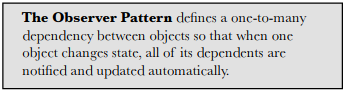
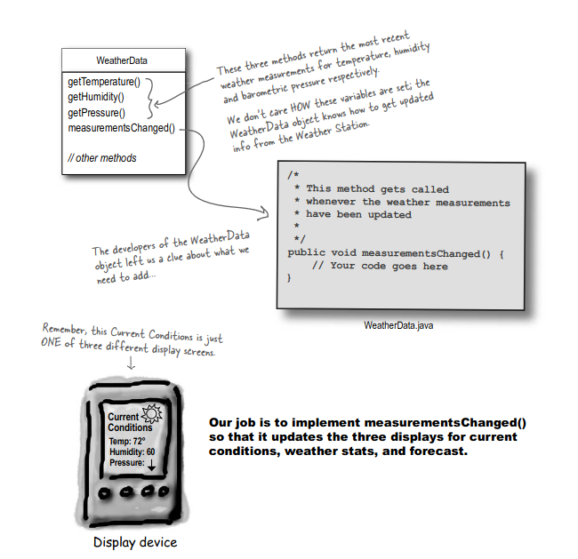
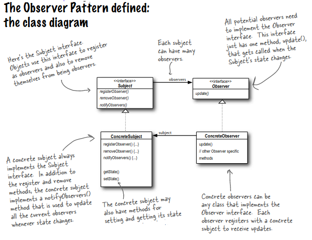
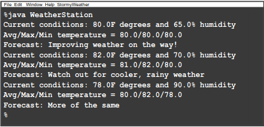

# Observer Design Pattern



## Introduction
We have to build  Weather-O-Rama,Internet-based Weather Monitoring Station.
Our system consist of three part: the weather station (the physical device that acquires the actual weather data), the WeatherData object (that tracks the data coming from the Weather Station and updates the displays), and the display that shows users the current weather conditions.

The WeatherData object knows how to talk to the physical Weather Station, to get updated data. The WeatherData object then updates its displays for the three different display elements: Current Conditions (shows temperature, humidity, and pressure), Weather Statistics, and a simple forecast.Current Conditions is  one of three different displays. The user can also get weather stats and a forecast.

Our job, if we choose to accept it, is to create an app that uses the WeatherData object to update three displays for current conditions, weather stats, and a forecast.



We need to implement three display elements that use the weather data: a current conditions display, a statistics display and a forecast display. These displays must be updated each time WeatherData has new measurements.

The system must be expandable—other developers can create new custom display elements and users can add or remove as many display elements as they want to the application.  Currently, we know about only the initial three display types (current conditions, statistics and forecast).

## First approach

```java
public class WeatherData {
        public void measurementsChanged() {
            
                float temp = getTemperature();
                float humidity = getHumidity();
                float pressure = getPressure();
                
                currentConditionsDisplay.update(temp, humidity, pressure);
                statisticsDisplay.update(temp, humidity, pressure);
                forecastDisplay.update(temp, humidity, pressure);
        }

        // other WeatherData methods here}
}
```

### Problem with this implementation

We are coding to concrete implementations, not interfaces. For every new display element we need to alter code. By coding to concrete implementations we have no way to add (or remove) display elements at run time. 
All of three display class have update method. We need to encapsulate this area.


## The Observer Pattern defined

Observer Design Pattern is a behavioral design pattern. This pattern allows an instance (called subject) to publish events to other multiple instances (called observers).  These observers subscribe to the subject and hence get notified by events in case of any change happening in the subject. 





## Implementing the Weather Station

```java
public interface Subject {
    // Both of these methods take an Observer as an argument; that is, the Observer to be registered or removed.
    public void registerObserver(Observer o);
    public void removeObserver(Observer o);
    
    // This method is called to notify all observers when the Subject’s state has changed
    public void notifyObservers();
}

// The Observer interface is implemented by all observers, so they all have to implement the update() method.  Here we’re following Mary and Sue’s lead and passing the measurements to the observers.
public interface Observer {
    // These are the state values the Observers get from the Subject when a weather measurement changes
    public void update(float temp, float humidity, float pressure);
}

// The DisplayElement interface just includes one method, display(), that we will call when the display element needs to be displayed.
public interface DisplayElement {
    public void display();
}
```

### Implementing the Subject interface in WeatherData

```java
// WeatherData now implements the Subject interface
public class WeatherData implements Subject {
    
    // We’ve added an ArrayList to hold the Observers, and we create it in the constructor.
    private ArrayList observers;
    private float temperature;
    private float humidity;
    private float pressure;
    
    public WeatherData() {
        observers = new ArrayList();
    }    
    
    // When an observer registers, we just add it to the end of the list.
    public void registerObserver(Observer o) {
        observers.add(o);
    }    
    
    
    // Likewise, when an observer wants to un-register, we just take it off the list.
    public void removeObserver(Observer o) {
        int i = observers.indexOf(o);
        if (i >= 0) {
            observers.remove(i);
        }
    }    
    
    
    // Here’s the fun part; this is where we tell all the observers about the state.  Because they are all Observers, we know they all implement update(), so we know how to notify them. 
    public void notifyObservers() {
        for (int i = 0; i < observers.size(); i++) {
            Observer observer = (Observer)observers.get(i);
            observer.update(temperature, humidity, pressure);
        }
    }    
    
    // We notify the Observers when we get updated measurements from the Weather Station.
    public void measurementsChanged() {
        notifyObservers();
    }    
    
    
    public void setMeasurements(float temperature, float humidity, float pressure) {
        this.temperature = temperature;
        this.humidity = humidity;
        this.pressure = pressure;
        measurementsChanged();
    }
    // other WeatherData methods here}
}
```

###  Now, let’s build those display elements
Our system must have three display element: he current conditions display, the statistics display and the forecast display.

```java
// This display implements Observer so it can get changes from the WeatherData object. It also implements DisplayElement, because our API is going to require all display elements to implement this interface.
public class CurrentConditionsDisplay implements Observer, DisplayElement {
    private float temperature;
    private float humidity;
    private Subject weatherData;
    
    // he constructor is passed the weatherData object (the Subject) and we use it to register the display as an observer
    public CurrentConditionsDisplay(Subject weatherData) {
        this.weatherData = weatherData;
        weatherData.registerObserver(this);
    }    
    
    // When update() is called, we save the temp and humidity and call display().
    public void update(float temperature, float humidity, float pressure) {
        this.temperature = temperature;
        this.humidity = humidity;
        display();
    }    
    
    public void display() {
        System.out.println(“Current conditions: “ + temperature + “F degrees and “ + humidity + “% humidity”);    
    }
}
```

### Testing

```java
public class WeatherStation {
    public static void main(String[] args) {
        WeatherData weatherData = new WeatherData();
        
        CurrentConditionsDisplay currentDisplay = new CurrentConditionsDisplay(weatherData);
        StatisticsDisplay statisticsDisplay = new StatisticsDisplay(weatherData);
        ForecastDisplay forecastDisplay = new ForecastDisplay(weatherData);
        
        weatherData.setMeasurements(80, 65, 30.4f);
        weatherData.setMeasurements(82, 70, 29.2f);
        weatherData.setMeasurements(78, 90, 29.2f);
    }}
```



### Design principles in Observer Pattern

> Strive for loosely coupled designs between objects that interact

Loosely coupled designs allow us to build flexible OO systems that can handle change because they minimize the interdependency between objects.

The Observer Pattern provides an object design where subjects and observers are loosely coupled. The only thing the subject knows about an observer is that it implements a certain interface (the Observer interface).  It doesn’t need to know the concrete class of the observer, what it does, or anything else about it.

We can add new observers at any time.  Because the only thing the subject depends on is a list of objects that implement the Observer interface, we can add new observers whenever we want.  In fact, we can replace any observer at runtime with another observer and the subject will keep purring along.  Likewise, we can remove observers at any time.

We never need to modify the subject to add new types of observers. Let’s say we have a new concrete class come along that needs to be an observer.  We don’t need to make any changes to the subject to accommodate the new class type, all we have to do is implement the Observer interface in the new class and register as an observer.  The subject doesn’t care; it will deliver notifications to any object that implements the Observer interface.

We can reuse subjects or observers independently of each other. If we have another use for a subject or an observer, we can easily reuse them because the two aren’t tightly coupled.

Changes to either the subject or an observer will not affect the other.  Because the two are loosely coupled, we are free to make changes to either, as long as the objects still meet their obligations to implement the subject or observer interfaces.

> Identify the aspects of your application that vary and separate them from what stays the same. 

The thing that varies in the Observer Pattern is the state of the Subject and the number and types of Observers.   With this pattern, you can  vary the objects that are dependent on the state of the Subject, without having to change that Subject.   That’s called planning ahead


> Program to an interface, not an implementation.

Both the Subject and Observer use interfaces.  The Subject keeps track of objects implement-ing the Observer interface, while the observers register with, and get notified by, the Subject interface.  As we’ve seen, this keeps things nice and loosely coupled.

> Favor composition over inheritance.

The Observer Pattern uses composition to compose any number of Observers with their Subjects.  These relationships aren’t set up by some kind of inheritance hierarchy.  No, they are set up at runtime by composition!