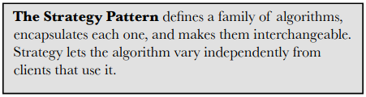
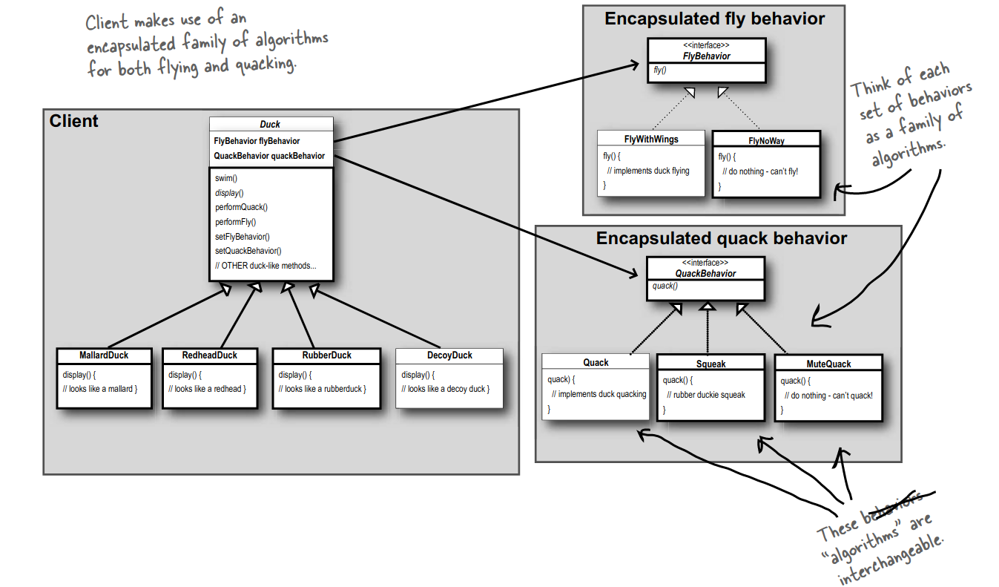

# Strategy Design Pattern


## Three principle of strategy pattern
> 1. Identify the aspects of your application that vary and separate them from what stays the same. 
> 2. Program to an interface, not an implementation.
> 3. Favor composition over inheritance.


## Introduction
Let's say, we must design duck simulation game.  The game can show a large variety of duck species swimming and making quacking sounds.  The initial designers of the system used standard OO techniques and created one Duck superclass from which all other duck types inherit.

If we are design our program as below, when we want to add new functionality to our class, for example fly() method in our sample, then other classes which inherent main class must implement same funcitionality. But when we need add rubber ducks to our class, which this duck cannot fly. Then we must override this method to NoFly manually. This is a situation we do not want.

```java
abstract class Duck {
    public void quack() {
        System.out.println("quack quack");
    }

    public void swim() {
        System.out.println("swim");
    }

    public void fly() {
        System.out.println("fly");
    }

    abstract void display();
}

class RubberDuck extends Duck{
    @Override
    void display() {
        System.out.println("looks like a rubber");
    }
}

```

We can overcome this problem by using interfaces. But this time, we must write same code for all classes. And this eliminate all advantages of OOP. 


```java
interface Flyable {
    void fly();
}

interface Quackable {
    void quack();
}
```

## First principle

> Identify the aspects of your application that vary and separate them from what stays the same.

In other words, if you’ve got some aspect of your code that is changing, say with every new requirement, then this part of code that needs to be pulled out and separated from all  the stuff that doesn’t change.

Here’s another way to think about this principle: take the parts that vary and encapsulate them, so that later you can  alter or extend the parts that vary without affecting  those that don’t.

As simple as this concept is, it forms the basis for almost every design pattern. All patterns provide a way to let some part of a system vary independently of all other parts.

We know that fly() and quack() are the parts of the Duck class that vary across ducks. To separate these behaviors from the Duck class, we’ll pull both methods out of the Duck class and create a new set of classes to represent each behavior. With this design, other types of objects can  reuse our fly and quack behaviors because  these behaviors are no longer hidden away  in our Duck classes! And we can add new behaviors without  modifying any of our existing behavior  classes or touching any of the Duck classes  that use flying behaviors.

## Second principle

> Program to an interface, not an implementation.

We need to design our program so that our main class won't need to know anything about the implementation details. That should be a loosly couple.

Before, a behavior either came from a concrete implementation in the superclass Duck, or by providing a specialized implementation in the subclass itself. In both cases we were relying on an implementation. We were locked into using that specific implementation and there was no option for changing out the behavior at runtime(other than writing more code). This is called program to implementation.

We should design our program to interface. First we’ll need to two interface: FlyBehaviour and QuackBehavior. Then add two instance variables to the Duck class called flyBehavior and quackBehavior, that are declared as the interface type.

In this way, our main class will have no information about the implementation of these behaviors. Class will only know that, it must be perform this behaviour. As a result, we can change the behavior of our Main class using setter methods without writing any additional code and without creating additional problems. With the help of performFly() and performQuack() methods, instead of implementing this behaviour, the Duck object delegates that behavior to the object referenced by quackBehavior. And we don’t care what kind of object it is, all we care about is that it knows how to quack()!


```java
interface FlyBehavior {
    void fly();
}

interface QuackBehavior {
    void quack();
}

class FlyWithWings implements FlyBehavior{
    public void fly() {
        System.out.println("fly");
    }
}

class FlyNoWay implements FlyBehavior{
    public void fly() {}
}

class Squeak implements QuackBehavior {
    public void quack() {
        System.out.println("Squeak squeak");
    }
}

class Quack implements QuackBehavior {
    public void quack() {
        System.out.println("Quack quack");
    }
}
```


```java
abstract class Duck {
    FlyBehavior flyBehavior;
    QuackBehavior quackBehavior;

    public Duck() {
    }

    public void performFly() {
        flyBehavior.fly();
    }

    public void performQuack() {
        quackBehavior.quack();
    }

    public void setFlyBehavior(FlyBehavior flyBehavior) {
        this.flyBehavior = flyBehavior;
    }

    public void setQuackBehavior(QuackBehavior quackBehavior) {
        this.quackBehavior = quackBehavior;
    }

    abstract void display();
}
```


Finally, let's declare RubberDuck as a class inherent from the Duck main class. This class starts with default behaviors. Then we can easily change these behaviors through setter methods.

```java
class RubberDuck extends Duck {
    public RubberDuck() {
        flyBehavior = new FlyWithWings();
        quackBehavior = new Squeak();
    }

    @Override
    void display() {
        System.out.println("looks like a rubber");
    }
}


public class MiniDuckSimulator {
    public static void main(String[] args) {
        Duck mallard = new RubberDuck(); 
        mallard.performQuack();
        mallard.performFly();
        Duck model = new ModelDuck();
        model.performFly();
        model.setFlyBehavior(new FlyNoWay()); 
        model.performFly();
    }
}
```

## Third principle
> Favor composition over inheritance.

Inheritance means is-a relationship. In our case RubberDuck is a Duck. Composition means has-a relationship. Each duck has a fly and quack behaviour.

As you’ve seen, creating systems using composition gives you a lot more flexibility. Not only does it let you encapsulate a family of algorithms into their own set of classes, but it also lets you change behavior at runtime  as long as the object you’re composing with implements the correct behavior interface. 

Composition is used in many design patterns and you’ll see a lot more about its advantages and disadvantages throughout the book.

## The Big Picture on  encapsulated behaviors
Notice also that we’ve started to describe things a little differently.  Instead of thinking of the duck behaviors as a set of  behaviors, we’ll start thinking of them as a  family of  algorithms. Think about it: in the SimUDuck design, the algorithms represent things a duck would do (different ways of quacking or fl ying), but we could just as easily use the same techniques for a set of classes that implement the ways to compute state sales tax by different states.



